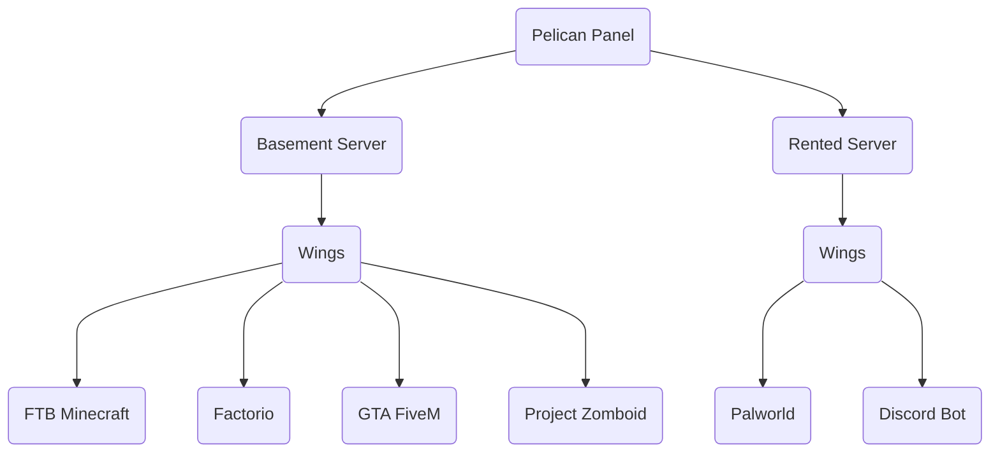

# Glossary

### What is ...?

**Panel** — A web application that connects to Wings and provides secure control over your servers.

**Wings** — A service that securely manages server instances through Panel.

**Node** — A machine (computer or server) running Wings, linking it to Panel.

**Server** — An instance of a container, maintained by Wings, for running applications.

**Docker** — A platform that runs applications in isolated containers.

**Docker Image**  — A package containing all dependencies and libraries required to run a container.

**Container** — A virtualized environment created by Docker for isolated application processes.

**Egg**  — A configuration file that defines how to run a Docker Image.

**Yolk**  — A curated collection of core Docker Images for use with Pelican's Eggs.

## Basic Example Setup Diagram

