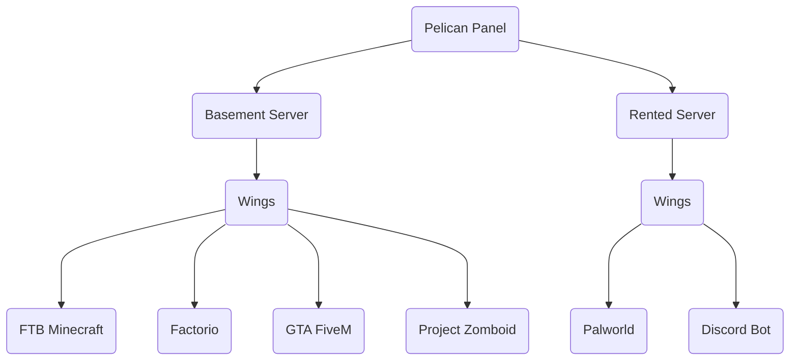

# What is ...?

### Things & Words

**Panel** — A web application that interfaces with Wings and lets you control your Servers.

**Node** — A node is a computer that runs Wings to connect to the Panel.

**Wings** — This application gives you secure control of your Servers via your Panel.

**Server** — In our case, a server refers to a running container (instance) that is maintained by Wings.

**Docker** — Docker is a platform that lets you run applications in isolated and secure containers.

**Docker Image**  — Contains everything (libraries, dependencies, files) needed to run a Container.

**Container** — A virtualized and isolated environment for your Server to run in.

**Egg**  — Holds the configuration to run a Docker Image in a specific manner.

**Yolks**  — A curated collection of (core) Docker Images that can be used with Pelican's Eggs.

## Basic Example Setup Diagram

