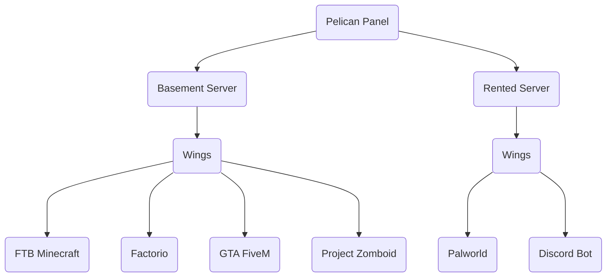

# Glossary

### What is ...?

**Panel** — web application that interfaces with Wings and lets you control your Servers.

**Wings** — application that gives you secure control of your Servers via your Panel.

**Node** — machine (computer or server) that runs Wings to connect to the Panel.

**Server** — instance of a Container that is maintained by Wings.

**Docker** — platform that lets you run Servers in isolated containers.

**Docker Image**  — file that contains libraries, dependencies, files, etc needed to run a Container.

**Container** — virtualized environment that your Servers run in.

**Egg**  — file that configures how to run a Docker Image.

**Yolk**  — curated collection of (core) Docker Images that can be used with Pelican's Eggs.

## Basic Example Setup Diagram

