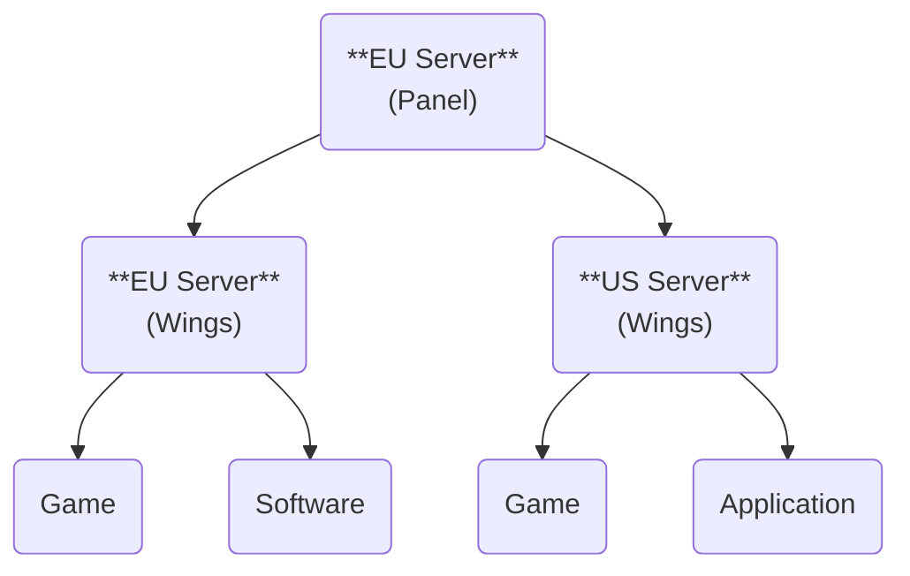

import Admonition from '@theme/Admonition';
import Tabs from '@theme/Tabs';
import TabItem from '@theme/TabItem';

# Introduction

### What is [Pelican](https://github.com/pelican-dev/panel)?

**Pelican** is a generic server management panel, designed for hosting and managing isolated Docker containers containing game servers, software and applications.
It is a heavily modified fork of [**Pterodactyl**](https://pterodactyl.io/), which focuses on game server management. 

The panel handles frontend interactions; this typically involves showing relevant information about a server, and sending commands to the containers.

### What is [Wings](https://github.com/pelican-dev/wings)?

**Wings** is a service worker that acts as a node, handling Docker containers created on Pelican behind-the-scenes.

Wings deals with the backend infrastructure such as managing, servicing, starting, restarting and stopping the container. The user never directly interacts with Wings.

### Open Source Software {#open-source}
Pelican is developed and released under [AGPLv3](https://www.gnu.org/licenses/agpl-3.0.en.html), an open source license; Wings is also open source, licensed under [MIT](https://opensource.org/license/mit)!
Contributions are welcome, and there are plenty of unresolved issues and feature requests on [GitHub](https://github.com/pelican-dev).

### Glossary {#glossary}

**Pelican** / **Panel** is a web application built in Filament, which provides an interface for Wings containers, called "Servers" within the client.

**Wings** / **Node** is a service worker which handles the management of Docker containers by fulfilling the panel's requests.

**Server** / **Container** is a virtualized environment isolated within your network managed by Wings.

**Egg** is a file that provides default configurations when creating servers, utilising Yolks (or Docker Images).

**Docker** is an open platform that allows you to easily run Docker containers in an isolated network.

**Docker Image** is a file which contains libraries, dependencies, files, and more needed to run containers.

**Yolks** are a curated collection of Docker Images provided by Pelican which are intended to function with Eggs.

### Features

:::info[[Pelican Demo](https://demo.pelican.dev)]
Do you want to try current and upcoming features? Check it out [here](https://demo.pelican.dev)!
:::

<Tabs>
    <TabItem value="1" label="General">
        *  First party Plugins & Themes
        *  Rework allocations
        *  More database types for Database Hosts
        *  Webhooks
        *  Roles & Permissions for Admins
        *  Replace Nests & Locations with Tags
        *  Config option for Binary Prefix (MiB/GiB)
        *  Improved Settings page
        *  Customization for Users (e.g. Server list layout, Console font)
    </TabItem>
    <TabItem value="2" label="Frontend">
        *  Localized Frontend
        *  User avatars
        *  Rewrite of Client Area in Filament
        *  Rewrite of Admin Area in Filament
        *  Switch from Webpack to Vite
        *  Timezone configurable per User
    </TabItem>
    <TabItem value="3" label="API">
        *  Integrated API docs
        *  Application API for Database Hosts
        *  Application API for Server Transfers
        *  Application API for Mounts
        *  Uniform user transformers
        *  Rename `oom_disabled` to `oom_killer`
    </TabItem>
    <TabItem value="4" label="Auth">
        *  Replace Google reCAPTCHA with Cloudflare Turnstile
        *  OAuth
    </TabItem>
    <TabItem value="5" label="Setup">
        *  Dockerized Installation
        *  Easier Installation process (Web Installer)
        *  PostgreSQL as Panel database
        *  SQLite as Panel database
        *  "Proper" support for MariaDB as Panel database (dedicated driver)
        *  Easier Database Host setup via Step-by-Step Wizard
    </TabItem>
    <TabItem value="6" label="Server">
        *  Server sorting
        *  Activity log for server crashes
        *  Easier Schedule Cron setup
        *  View install logs from within the Panel
        *  Servers without Allocations
        *  IPv6 Support for Allocations
        *  Custom docker labels for server containers
        *  "Delete files" schedule task
        *  Global search for files
        *  Delete backups when server is deleted
    </TabItem>
    <TabItem value="7" label="Node">
        *  More effective wings disk quota
        *  Automatically fetch Node IPs for easier Allocation setup
        *  Better proxy support
        *  Node Ownership (assign nodes to roles)
        *  Node resource statistics
        *  CPU Limit for Nodes
        *  Alias for SFTP address
        *  Automatic cleanup of dangling docker images
        *  Fixed `-1` overallocation
    </TabItem>
    <TabItem value="8" label="Eggs">
        *  Easier Egg installing
        *  Change Egg format to YAML
        *  Sortable egg variables
        *  Import multiple eggs at once
        *  Easier Egg updating (usage of `update_url`)
    </TabItem>
    <TabItem value="9" label="Hub">
        *  Marketplace for Eggs
        *  Marketplace for Plugins & Themes
        *  Open Finances
        *  Support Tickets
    </TabItem>
</Tabs>

## Example of a Typical Setup {#setup-reference}

:::danger[Reporting Security Vulnerabilities]
When discussing security concerns, please be responsible and reach out via **team@pelican.dev**.

If you've discovered a critical issue, please disclose this with the team immediately through appropriate means. **GitHub is not for zero-day vulnerabilities.**
:::